# .NET Ecosystem

A compact overview of the **.NET ecosystem**, including its evolution from **.NET Framework** to **.NET Core** and modern **.NET**, the **CLR execution model**, **.NET Standard**, and the **Base Class Library (BCL)**.

> The explanations and diagrams in this README are based on the provided `.NET ecosystem` source material. The timeline diagrams are reproduced from that material.

## Contents

- [.NET Evolution](#net-evolution)
- [.NET Ecosystem Components](#net-ecosystem-components)
- [How C# Code Runs](#how-c-code-runs)
- [.NET Framework and ASP.NET](#net-framework-and-aspnet)
- [.NET Timeline](#net-timeline)
- [.NET Standard](#net-standard)
- [.NET Standard Compatibility](#net-standard-compatibility)
- [.NET Standard Example](#net-standard-example)
- [Base Class Library (BCL)](#base-class-library-bcl)
- [Repository Structure](#repository-structure)

---

## .NET Evolution

The source material presents the .NET platform in three broad stages:

- **.NET Framework (2002)** - the original Windows-focused implementation.
- **.NET Core (2016)** - introduced as a cross-platform implementation, decoupling .NET from Windows-only execution.
- **.NET (2020)** - the unified modern .NET platform.

<p align="center">
  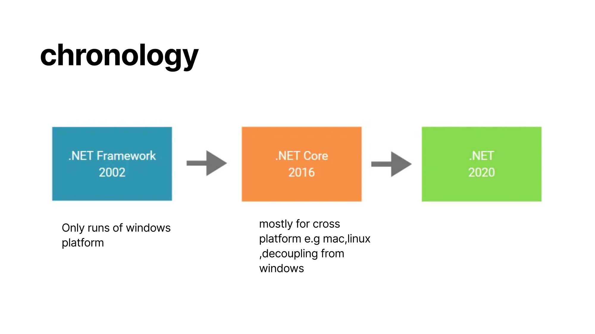
</p>

---

## .NET Ecosystem Components

The ecosystem can be viewed as three major parts:

| Area | Examples / Role |
|---|---|
| **Languages** | C#, F# |
| **Runtime** | CoreCLR / CLR execution environment |
| **Libraries** | Base Class Library (BCL) and third-party libraries |

A .NET application is written in a supported language, compiled into an intermediate representation, and then executed by the runtime.

---

## How C# Code Runs

A C# program is not normally compiled directly into the final machine code for a specific processor. The source material describes the flow as:

```text
C# Source Code
      |
      v
C# Compiler
      |
      v
Intermediate Language (IL)
      |
      v
CLR / CoreCLR
      |
      v
JIT Compilation
      |
      v
Machine-specific code
```

The **Intermediate Language (IL)** is platform-independent. While the program runs, the **CLR** uses a **Just-In-Time (JIT)** compiler to translate IL into machine-specific code.

<p align="center">
  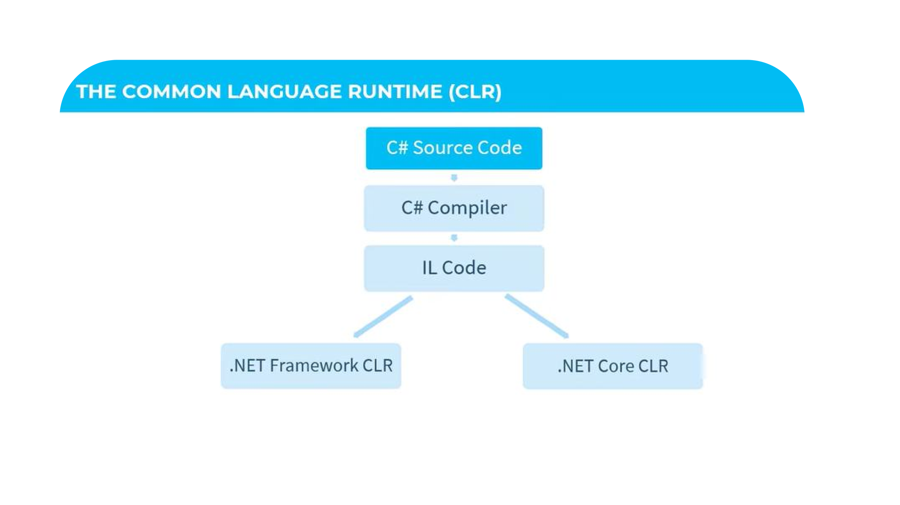
</p>

---

## .NET Framework and ASP.NET

The source notes that **.NET Framework 1.0** introduced core pieces of the platform, including:

- The .NET CLR
- Base class libraries
- ASP.NET
- Visual Studio .NET

**ASP.NET** is Microsoft's web development framework within the .NET ecosystem.

---

## .NET Timeline

The following diagrams reproduce the timeline sections from the source material.

### .NET Framework 1.0 to 4.0

<p align="center">
  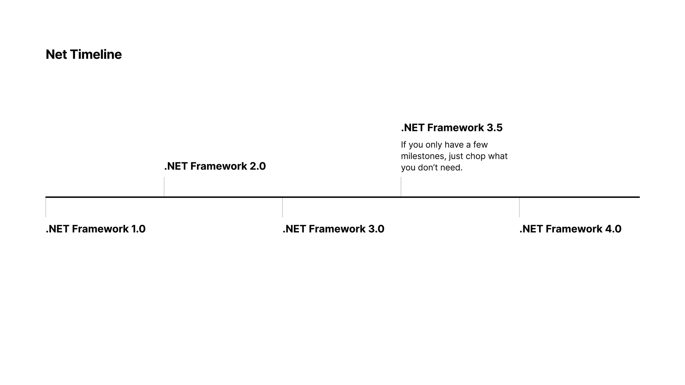
</p>

### .NET Framework 4.5 through .NET Core 1.0

<p align="center">
  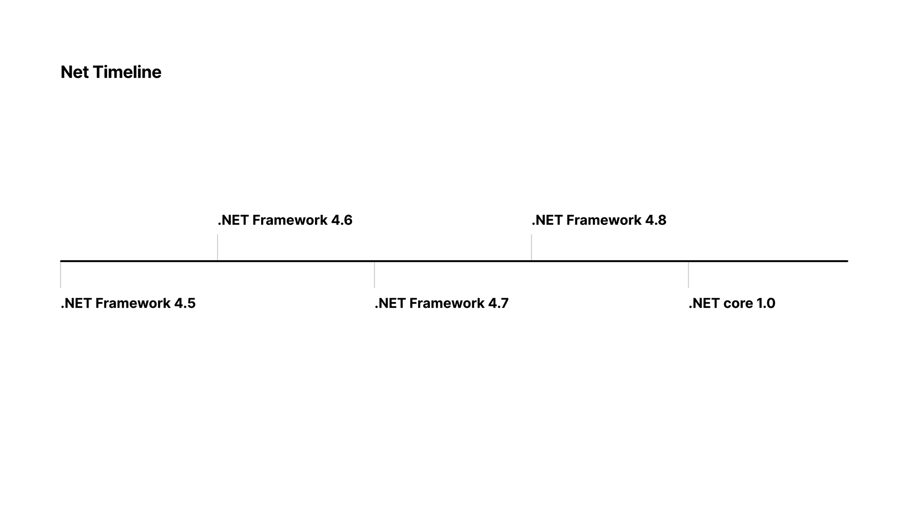
</p>

### .NET Core 2.0 through .NET Core 3.1

<p align="center">
  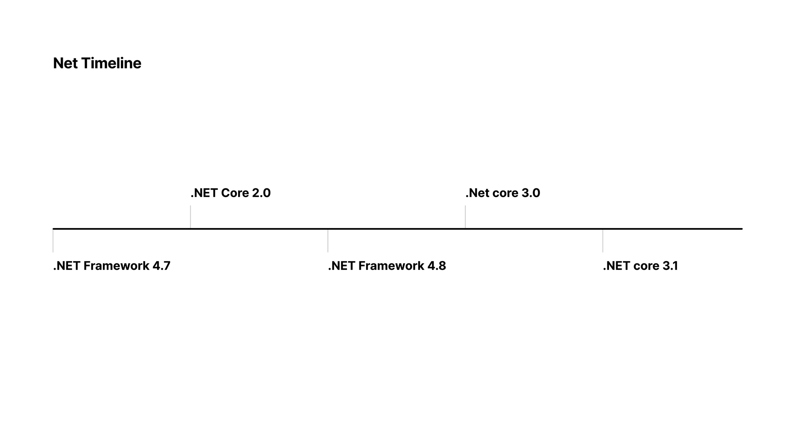
</p>

### .NET 5 through .NET 8

The source describes **.NET 5** as the point where the platform moved toward a unified `.NET` name rather than continuing the `.NET Core` branding.

<p align="center">
  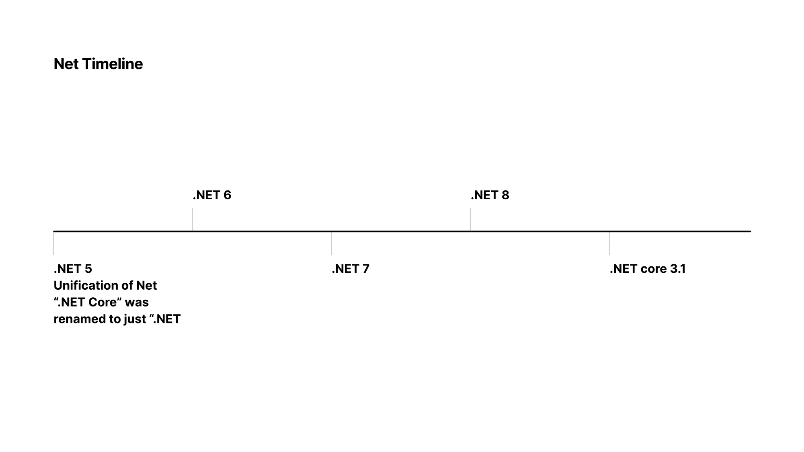
</p>

### .NET 9 through .NET 11

<p align="center">
  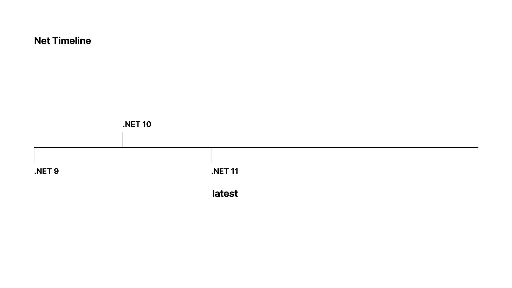
</p>

---

## .NET Standard

**.NET Standard** is presented as a formal API specification that different .NET implementations can implement.

Its purpose was to make it easier to share libraries across different .NET implementations, including:

- .NET Framework
- .NET Core
- Mono
- Xamarin
- UWP
- Unity

A framework that implements a given .NET Standard version exposes the APIs required by that specification.

The source identifies **.NET Standard 2.1** as the final version of the specification and explains that modern .NET development, beginning with the unified .NET platform, no longer relies on .NET Standard in the same way.

---

## .NET Standard Compatibility

Different .NET implementations support different .NET Standard versions. The following table is the compatibility diagram from the source material.

<p align="center">
  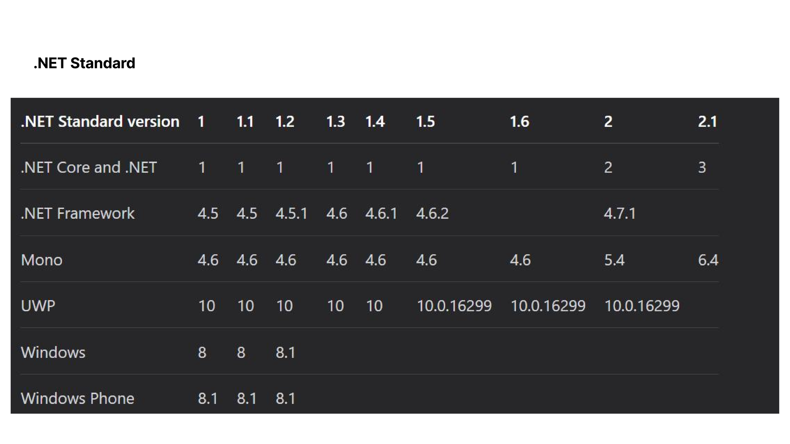
</p>

The next diagram illustrates the relationship between an implementation and the API surface defined by .NET Standard.

<p align="center">
  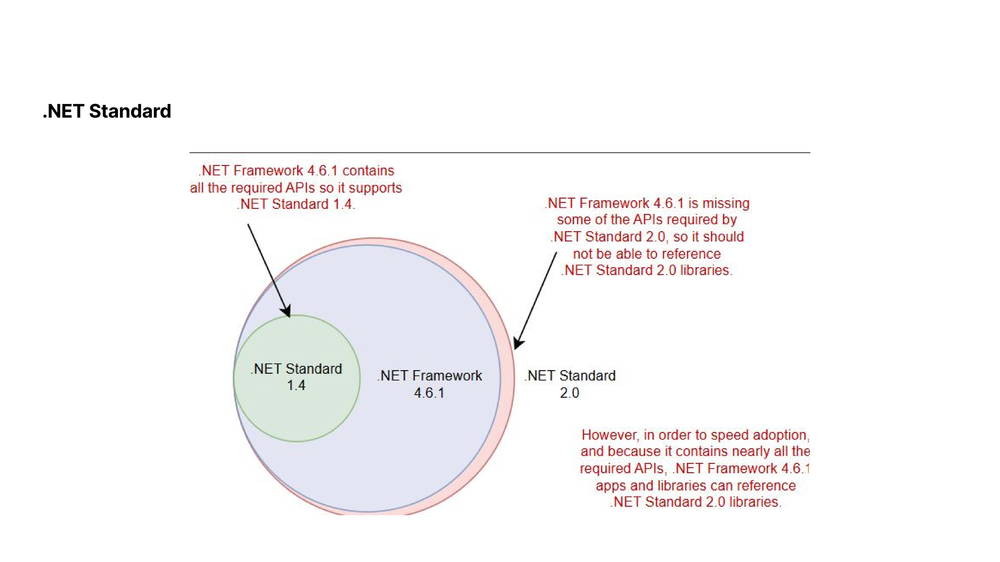
</p>

---

## .NET Standard Example

A later .NET Standard version inherits the APIs made available by an earlier version. The source gives the following conceptual example:

```csharp
// APIs available in .NET Standard 1.0
interface NETStandard1_0
{
    void SomeMethod();
}

// .NET Standard 1.1 inherits the APIs from .NET Standard 1.0
interface NETStandard1_1 : NETStandard1_0
{
    void OtherMethod();
}
```

### Shared .NET Standard Class Library

<p align="center">
  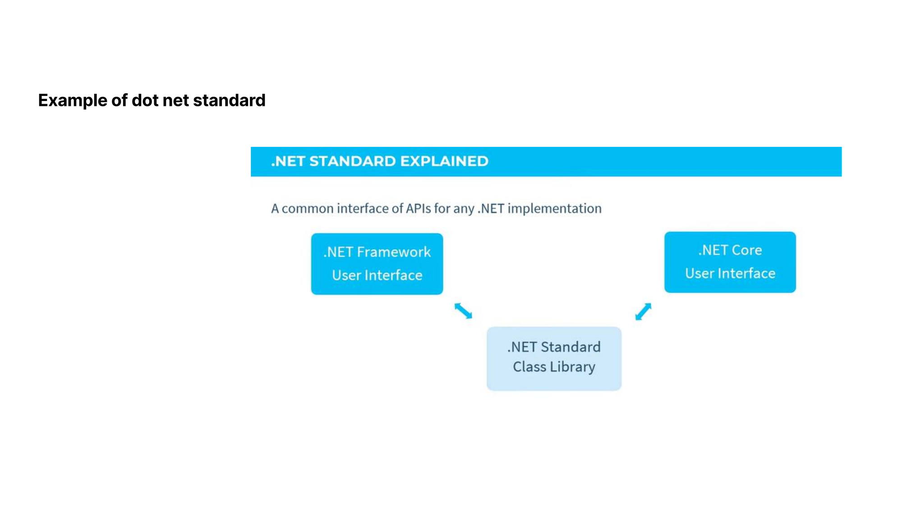
</p>

### .NET Core User Interface Using a .NET Standard Library

<p align="center">
  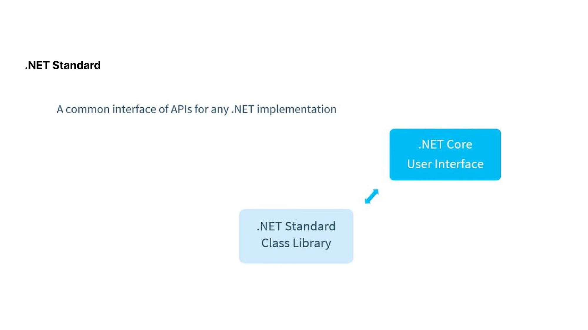
</p>

### .NET Core Library Relationship

<p align="center">
  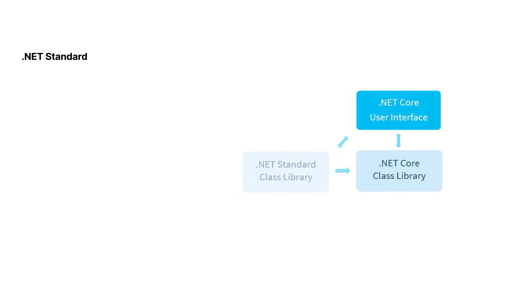
</p>

---

## Base Class Library (BCL)

The **Base Class Library (BCL)** provides commonly used functionality available to .NET applications.

The source diagram shows areas such as:

- `System.Web`
- `System.Windows.Forms`
- `System.Drawing`
- `System.Data`
- `System.Xml`
- Collections
- I/O
- Security
- Runtime services
- Configuration
- Networking
- Diagnostics
- Reflection
- Text handling
- Threading
- Serialization
- Resources and globalization

<p align="center">
  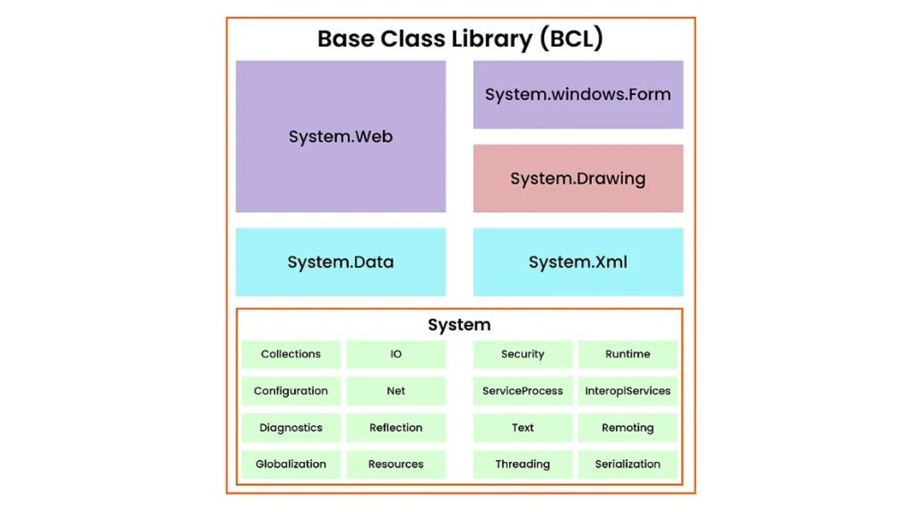
</p>

---

## Repository Structure

```text
.
├── README.md
└── docs/
    └── images/
        ├── 01-dotnet-chronology.png
        ├── 02-clr-execution-flow.png
        ├── 03-dotnet-timeline-framework-1-to-4.png
        ├── 04-dotnet-timeline-framework-4-5-to-core-1.png
        ├── 05-dotnet-timeline-core-2-to-core-3-1.png
        ├── 06-dotnet-timeline-dotnet-5-to-8.png
        ├── 07-dotnet-timeline-dotnet-9-to-11.png
        ├── 08-dotnet-standard-compatibility-table.png
        ├── 09-dotnet-standard-compatibility-diagram.png
        ├── 10-dotnet-standard-example.png
        ├── 11-dotnet-standard-core-ui.png
        ├── 12-dotnet-standard-core-library.png
        └── 13-base-class-library-bcl.png
```

## Add It to GitHub

Copy `README.md` and the `docs` folder into the root of your repository, then run:

```bash
git add README.md docs/
git commit -m "Add .NET ecosystem documentation"
git push
```

GitHub will automatically render `README.md` on the repository home page, including all of the diagrams above.
